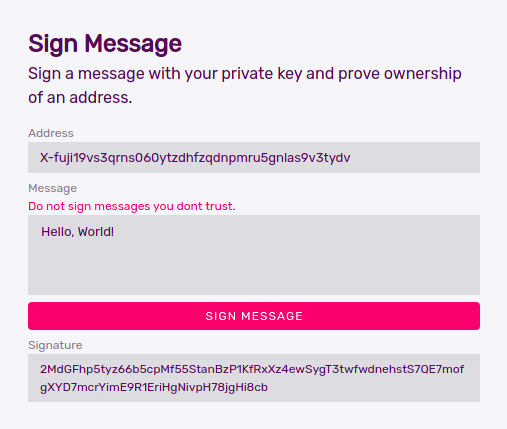

# Introduction

This tutorial will show you how to use an Avalanche C-Chain dApp to verify the signature of a message like this that has been signed using the Avalanche Wallet.



We at [red·dev](https://www.red.dev) needed to do this for our current software project under development, [RediYeti](https://www.rediyeti.com). We have a use-case where we need to verify ownership of an Avalanche X-Chain address before the dApp sends funds related to this address. To prevent fraud, the verification must take place inside the dApp.

You may also find this tutorial useful if you would like to learn how Avalanche signatures work and how cryptography is implemented on the X-Chain and on the C-Chain. 

We have included code snippets throughout, and you can find the entire project [here](https://github.com/red-dev-inc/sig-verify-tutorial). Many steps are involved, but once you understand how they fit together, you will have a deeper understanding of how this aspect of Avalanche—and indeed cryptocurrencies in general—work.

## Audience
To get the most out of this tutorial, you will need to have a basic understanding of Javascript, Node, Solidity, and how to develop dapps in Avalanche. You should also know the basics of public key cryptography. If you do not yet know about these topics, see the **Resources** section at the end for links to learn more.

## Why are digital signatures important?
Digital signatures are primitives used for public-key cryptography message authentication. A digital signature system allows you to generate your own private/public key pair, and use the private key to generate digital signatures that proves you are the owner of the public key without having to reveal the private key.

Avalanche uses Elliptic Curve Cryptography (ECC) as do Bitcoin, Ethereum, and many others. The ECC algorithm used for the digital signature is known as ECDSA (Elliptic Curve Digital Signature Algorithm).
## Overview

At the very highest level, here is an overview of the process we will take you through in this tutorial. First we use a simple webapp to gather the three inputs: signing address, message, and signature. We extract the cryptographic data from them that will be needed to pass in the dApp to verify the signature.

The dApp then verifies in two steps. First, it makes sure that all the values passed to it are provably related to each other. Then, assuming that they are, it uses the [elliptic-curve-solidity](https://github.com/tdrerup/elliptic-curve-solidity) library, which we slightly modify to work with Avalanche, to verify the signature.

The dApp returns its result to the webapp which displays it. Of course, in the real world, you will want to take some more actions in the dApp based on the result, depending on your needs.

We have set up a [demo webpage here](https://rediyeti.com/avax-sig-verify-demo).

## Requirements

Metamask needs to be installed on your browser, and you need to be connected to the Avalanche Fuji Test network (for this tutorial). You can add a few lines of codes to check if your browser has metamask installed, and if installed, then to which network you are connected. For instance:

```javascript
function checkMetamaskStatus() {
    if(window.ethereum) {
        if(window.ethereum.chainId != '0xa869') {
            result = "Failed: Not connected to Avalanche Fuji Testnet via Metamask."
        }
        else {
            //call required function
        }
    }
    else {
        result = "Failed: Metamask is not installed."
    }
},
```

## Dependencies 
1. NodeJS v8.9.4 or later.
2. AvalancheJS library, which you can install with `npm install avalanche` 
3. Elliptic Curve library, which can be installed with `npm install elliptic`
4. Ethers.js library, which can be installed with `npm install ethers`

## Steps that need to be performed in the webapp

To verify the signature and retrieve the signer X-Chain address, you first need to extract cryptographic data from the message and signature in your webapp, which will then be passed to the dApp. (The example code uses a **Vue** webapp, but you could use any framework you like or just vanilla Javascript.) These are:

1. Hashed message
2. r, s, and v parameters of the signature
3. x and y coordinates of the public key and the 33-byte compressed public key

We extract them using Javascript instead of in the dApp because the Solidity EC library needs them to be separated, and it is easier to do it in Javascript. There is no security risk in doing it here off-chain as we can verify in the dApp that they are indeed related to each other, returning a signature failure if they are not.

### 1. Hash the message

First, you will need to hash the original message. Here is the standard way of hashing the message based on the Bitcoin Script format and Ethereum format -


```
sha256(length(prefix) + prefix + length(message) + message)
```

The prefix is a so-called "magic prefix" string `\x1AAvalanche Signed Message:\n`, where `0x1A` is the length of the prefix text and `length(message)` is an integer of the message size. After concatenating these together, hash the result with `sha256`. For example:

```javascript
function hashMessage() {
    let mBuf = Buffer.from(message, 'utf8')       
    let msgSize = Buffer.alloc(4)                 
    msgSize.writeUInt32BE(mBuf.length, 0)         
    let msgBuf = Buffer.from(`\x1AAvalanche Signed Message:\n${msgSize}${this.msg}`, 'utf8')
    let hash = createHash('sha256').update(msgBuf).digest()
    let hashex = hash.toString('hex')
    let hashBuff = Buffer.from(hashex, 'hex')
    let messageHash = '0x' + hashex
    return {hashBuff, messageHash}
},
```
### 2. Split the Signature

Avalanche Wallet displays the signature in CB58 Encoded form. So, first, you will need to decode the signature from CB58. 

Then, with the decoded signature, you can recover the public key by parsing out the r, s, and v parameters from it. The signature is stored as a 65-byte buffer `[R || S || V]` where `V` is 0 or 1 to allow quick public key recoverability. 

Note, while decoding the signature, if the signature has been altered, the cb58Decode function may throw an error, so remember to catch the error. Also, don't forget to import bintools from AvalancheJS library first.

#### Example

```javascript
function splitSig() {
    try{
        let bintools = BinTools.getInstance()
        let decodedSig = bintools.cb58Decode(signature)
        const r = new BN(bintools.copyFrom(decodedSig, 0, 32))
        const s = new BN(bintools.copyFrom(decodedSig, 32, 64))
        const v = bintools.copyFrom(decodedSig, 64, 65).readUIntBE(0, 1)
        const sigParam = {
          r: r,
          s: s,
          v: v
        }
        let rhex = '0x' + r.toString('hex')     //converts r to hex
        let shex = '0x' + s.toString('hex')   //converts s to hex
        let sigHex = [rhex, shex]
        return {sigParam, sigHex}
    }
    catch{
        result = "Failed: Invalid signature."
    }
},
```

### 3. Recover the Public Key

The public key can be recovered from the hashed message, r, s, and v parameters of the signature with the help of Elliptic Curve JS library. You need to extract x and y coordinates of the public key to verify the signature as well as the 33-byte compressed public key to later recover signer X-Chain address. 

#### Example

```javascript
function recover(msgHash, sig) {
    let ec = new EC('secp256k1')
    const pubk = ec.recoverPubKey(msgHash, sig, sig.v)
    const pubkx = '0x' + pubk.x.toString('hex')     
    const pubky = '0x' + pubk.y.toString('hex')     
    let pubkCord = [pubkx, pubky]
    let pubkBuff = Buffer.from(pubk.encodeCompressed())
    return {pubkCord, pubkBuff}
},
```
Here is the full code for verification

```javascript
async function verify() {
    //Create the provider and contract object to access the dApp functions
    const provider = new ethers.providers.Web3Provider(window.ethereum)
    const elliptic = new ethers.Contract(contractAddress.Contract, ECArtifact.abi, provider)
    //Extract all the data needed for signature verification
    let message = hashMessage()
    let sign = splitSig()
    let publicKey = recover(message.hashBuff, sign.sigParam)
    //prefix and hrp for Bech32 encoding
    let prefix = "fuji"
    let hrp = []
    for (var i=0; i<prefix.length; i++) {
        hrp[i] = prefix.charCodeAt(i)
    }
    //Call recoverAddress function from dApp. xchain and msg are user input in webapp
    const tx = await elliptic.recoverAddress(message.messageHash, sign.sigHex, publicKey.pubkCord, publicKey.pubkBuff, msg, xchain, prefix, hrp)
    result = tx 
}
```

## Recover the signer X-Chain address in dApp

In the dApp, pass the 33-byte compressed public key to recover the X-Chain Address. 

Addresses on the X-Chain use the Bech32 standard with an Avalanche-specific prefix of **X-**. Then there are four parts to the Bech32 address scheme that follow.

1. A human-readable part (HRP). On Avlanche mainnet this is **avax** and on Fuji testnet it is **fuji**.
2. The number **1**, which separates the HRP from the address and error correction code.
3. A base-32 encoded string representing the 20 byte address.
4. A 6-character base-32 encoded error correction code.

Like Bitcoin, the addressing scheme of the Avalanche X-Chain relies on the **secp256k1** elliptic curve. Avalanche follows a similar approach as Bitcoin and hashes the ECDSA public key, so the 33-byte compressed public key is hashed with **sha256** first and then the result is hashed with **ripemd160** to produce a 20-byte address.

Next, this 20-byte address is converted to a **Bech32** address.

The `recoverAddress` function is called in the dApp from the webappp.

**recoverAddress** takes the following parameters:

* messageHash — the hashed message
* rs — r and s value of the signature
* publicKey — x and y coordinates of the public key
* pubk — 33-byte compressed public key
* xchain — X-Chain address
* prefix — Prefix for Bech32 addressing scheme (avax or fuji)
* hrp — Array of each unicode character in the prefix

Then perform the following steps: 

1. Get the 20-byte address by hashing the 33-byte compressed public key with sha256 follwed by ripemd160.
2. Call the Bech32 functions to convert the 20-byte address to Bech32 address(or X-Chain address).
3. Match the extracted X-Chain address with the X-Chain address from the webapp.
4. If X-Chain Address matches then validate the signature. 
5. Return the result.

```solidity
function recoverAddress(bytes32 messageHash, uint[2] memory rs, uint[2] memory publicKey, bytes memory pubk, string memory xchain, string memory prefix, uint[] memory hrp) public view returns(string memory){
    bool signVerification = false;
    string memory result;
    bytes32 sha = sha256(abi.encodePacked(pubk));
    bytes20 ripesha = ripemd160(abi.encodePacked(sha));
    uint[] memory rp = new uint[](20);
    for(uint i=0;i<20;i++) {
        rp[i] = uint(uint8(ripesha[i]));
    }
    bytes memory pre = bytes(prefix);
    string memory xc = encode(pre, hrp, convert(rp, 8, 5));
    if(keccak256(abi.encodePacked(xc)) == keccak256(abi.encodePacked(xchain))) {
        signVerification = validateSignature(messageHash, rs, publicKey);
        if(signVerification == true) {
            result = "Signature verified!";
        }
        else {
            result = "Signature verification failed!";
        }    
    }
    else {
        result = string(abi.encodePacked("Failed: Addresses do not match. Address for this signature/message combination should be ", xc));
    }
    return result;
}
```

### Bech32 Encoding

We have ported Bech32 to Solidity from the [Bech32 Javascript library](https://github.com/bitcoinjs/bech32).
There are four functions, **polymod**, **prefixChk**, **encode** and **convert**, used to convert to Bech32 address. 

#### Example

```
bytes constant CHARSET = 'qpzry9x8gf2tvdw0s3jn54khce6mua7l';

function polymod(uint256 pre) internal view returns(uint) {
    uint256 chk = pre >> 25;
    chk = ((pre & 0x1ffffff) << 5)^(-((chk >> 0) & 1) & 0x3b6a57b2) ^
    (-((chk >> 1) & 1) & 0x26508e6d) ^
    (-((chk >> 2) & 1) & 0x1ea119fa) ^
    (-((chk >> 3) & 1) & 0x3d4233dd) ^
    (-((chk >> 4) & 1) & 0x2a1462b3); 
    return chk;
}

function prefixCheck(uint[] memory hrp) public view returns (uint) {
    uint chk = 1;
    uint c;
    uint v;
    for (uint pm = 0; pm < hrp.length; ++pm) {
        c = hrp[pm];
        chk = polymod(chk) ^ (c >> 5);
    }
    chk = polymod(chk); 
    for (uint pm = 0; pm < hrp.length; ++pm) {
        v = hrp[pm];
        chk = polymod(chk) ^ (v & 0x1f);
    }
    return chk;
}

function encode(bytes memory prefix, uint[] memory hrp, uint[] memory data) public view returns (string memory) {
    uint256 chk = prefixCheck(hrp);
    bytes memory add = '1';
    bytes memory result = abi.encodePacked(prefix, add);
    for (uint pm = 0; pm < data.length; ++pm) {
        uint256 x = data[pm];
        chk = polymod(chk) ^ x;
        result = abi.encodePacked(result, CHARSET[x]);
    }
    for (uint i = 0; i < 6; ++i) {
        chk = polymod(chk);
    }
    chk ^= 1;
    for (uint i = 0; i < 6; ++i) {
        uint256 v = (chk >> ((5 - i) * 5)) & 0x1f;
        result = abi.encodePacked(result, CHARSET[v]);
    }
    bytes memory chainid = 'X-';
    string memory s = string(abi.encodePacked(chainid, result));
    return s;
}

function convert(uint[] memory data, uint inBits, uint outBits) public view returns (uint[] memory) {
    uint value = 0;
    uint bits = 0;
    uint maxV = (1 << outBits) - 1;
    uint[] memory ret = new uint[](32);
    uint j = 0;
    for (uint i = 0; i < data.length; ++i) {
        value = (value << inBits) | data[i];
        bits += inBits;
        while (bits >= outBits) {
            bits -= outBits;
            ret[j] = (value >> bits) & maxV;
            j += 1;
        }
    }
    return ret;
}
```

### Validate Signature

Now you can check to see if the extracted X-Chain address from the public key matches with the X-Chain address from the webapp. It is very important to verify this. Otherwise, you may have a perfectly valid message signature but for a **different** X-Chain address. If they match then proceed to verify the signature. Otherwise, return an error message.

For verifying the signature, we start with this [Solidity project on Elliptic Curve](https://github.com/tdrerup/elliptic-curve-solidity). 

However, this project uses the **secp256r1** curve. As Avalanche uses **secp256k1** curve, we need to modify the constant values based on this curve. The constants now look like  this:

```
uint constant a = 0;
uint constant b = 7;
uint constant gx = 0x79BE667EF9DCBBAC55A06295CE870B07029BFCDB2DCE28D959F2815B16F81798;
uint constant gy = 0x483ADA7726A3C4655DA4FBFC0E1108A8FD17B448A68554199C47D08FFB10D4B8;
uint constant p = 0xFFFFFFFFFFFFFFFFFFFFFFFFFFFFFFFFFFFFFFFFFFFFFFFFFFFFFFFEFFFFFC2F;
uint constant n = 0xFFFFFFFFFFFFFFFFFFFFFFFFFFFFFFFEBAAEDCE6AF48A03BBFD25E8CD0364141;
```

The key function we need is **validateSignature**. 

```solidity
function validateSignature(bytes32 messageHash, uint[2] memory rs, uint[2] memory publicKey) public view returns (bool)
``` 
**validateSignature** takes the same first three parameters as **recoverAddress**:

* messageHash — the hashed message
* rs — r and s value of the signature
* publicKey — x and y coordinates of the public key

After performing these tests, the dApp returns its decision whether the signature is valid or not to the webapp, and the webapp then be responsible for showing the final output to the user. As we mentioned above, in the real world, you will probably want to add to your dApp to take futher actions accordingly.

# Resources
Here is a list of resources that can teach you the subjects you need to understand this tutorial.

1. This is a useful documentation from Ava Labs on cryptographic primitives: https://docs.avax.network/build/references/cryptographic-primitive2.
2. Here is a great YouTube video by Connor Daly of Ava Labs on how to use Hardhat to deploy and run your smart contract on Avalanche network: https://www.youtube.com/watch?v=UdzHxdfMKkE&t=1812s 
3. If you want to learn more on how the private/public keys and the wallets work, you may enjoy going through this awesome tutorial by Greg Walker: https://learnmeabitcoin.com/technical/
4. Andrea Corbellini does great work explaining Elliptic Curve Cryptography in detail in her blog post: https://andrea.corbellini.name/2015/05/17/elliptic-curve-cryptography-a-gentle-introduction/
